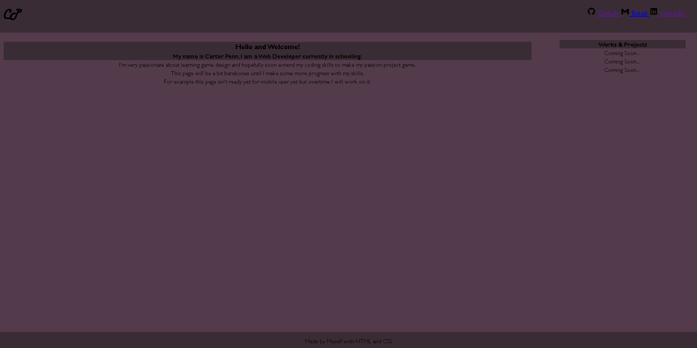
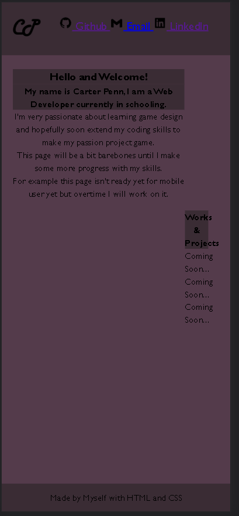

# portfolio
Hi this is the code for my Portfolio which is an always work in progess

for my first/base version of it i went with a more simple main box that has an about me and an sidebar that will have my works

This is what my V1 on the desktop looks like as of sept 12th

and this is what it is on the mobile

as you can see it still needs some work as my works &projects box isn't wrapping towards the bottom granted I didnt realised this until afterward so later I will fix it

I also don't have any placeholder images or works mainly because I don't really like the idea of posting an Portfolio of mine uses images and works I didn't make myself